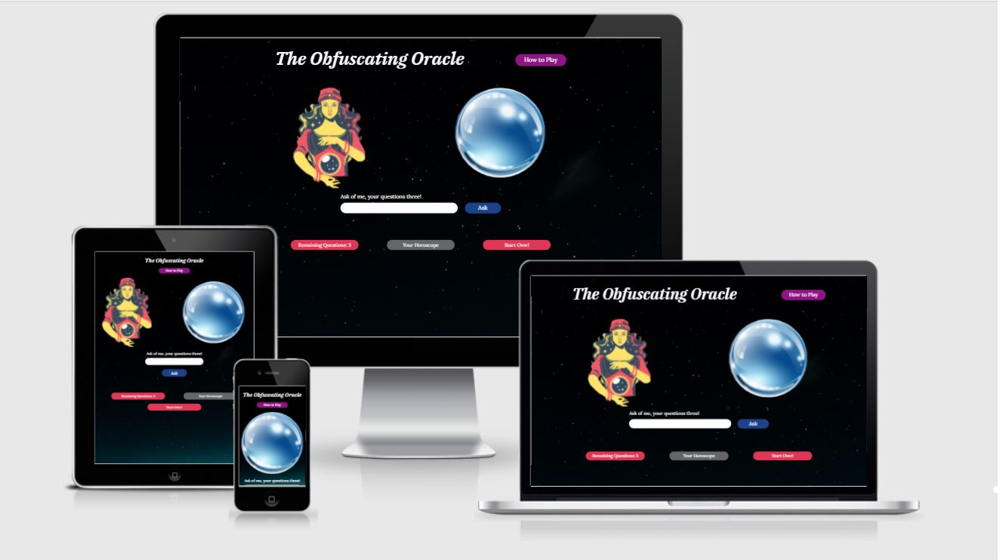
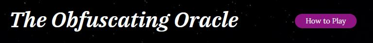
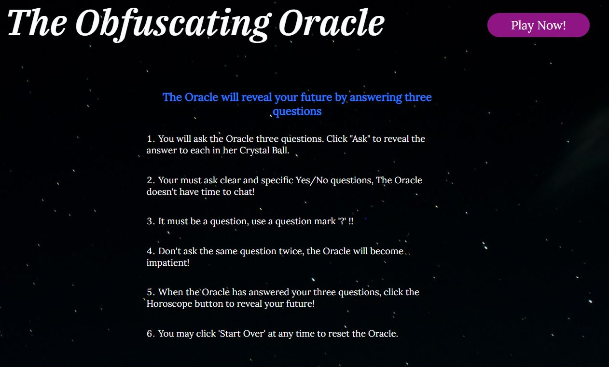
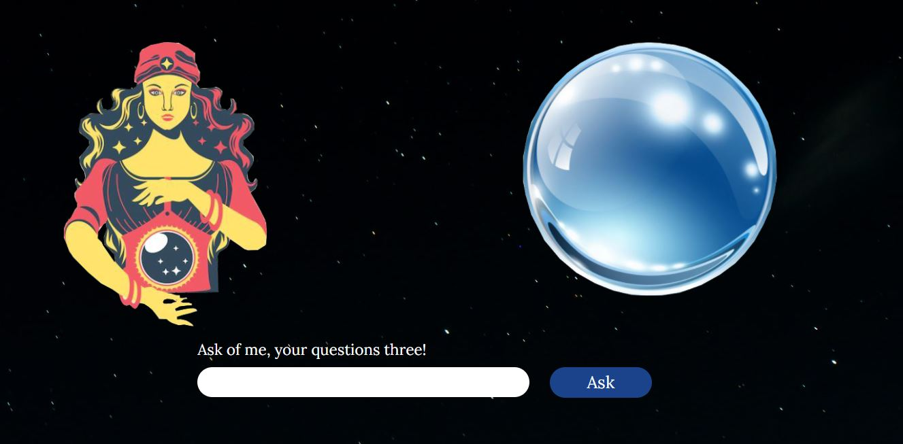
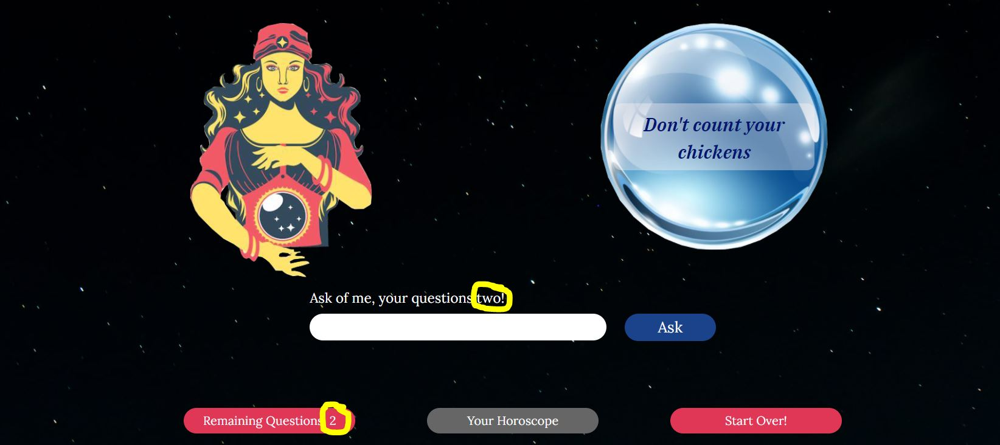
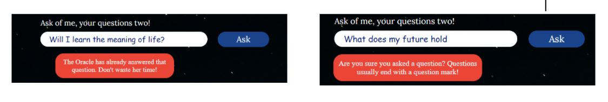
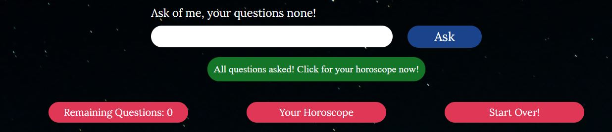
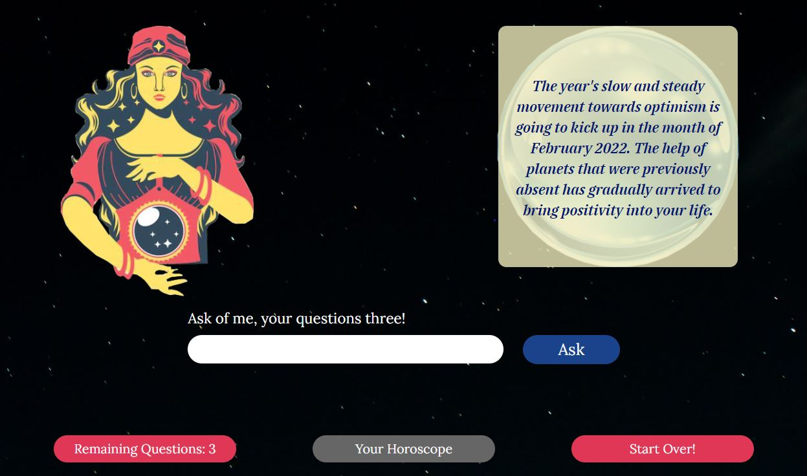
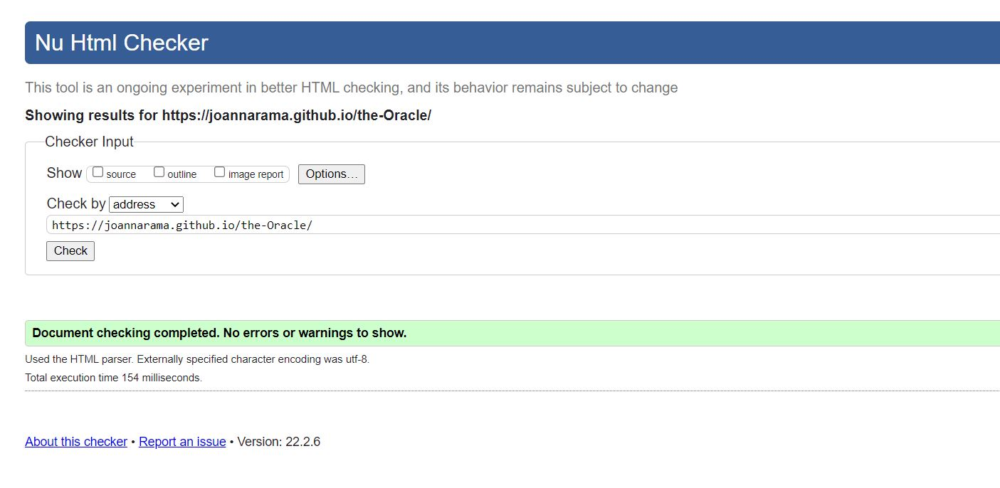
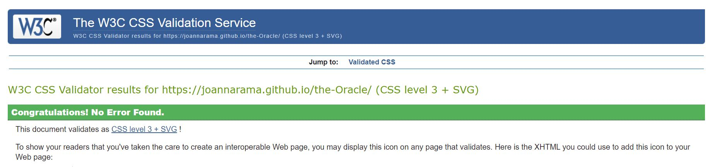

# PP2 - JavaScript Essentials - The Obfuscating Oracle

The Obfuscating Oracle is a fun interactive online game where the user poses questions to 'The Oracle' who returns her sage
wisdom and future predictions via her crystal ball. 

To play the game, the user asks three questions and recieves their answers. Once the three questions have been asked, the user has the option to reveal their horoscope message from the Oracle. 

This is a fun, light-hearted interactive game for users of all ages intended to amuse and entertain a general audience. 

## Live Site

[The Obfuscating Oracle](https://joannarama.github.io/the-Oracle/index.html)

## Repository
[Github repository](https://github.com/Joannarama/the-Oracle)

## Table of Contentshttps://github.com/Joannarama/the-Oracle
- [User Experience (UX)](#user-experience)
  - [User Stories](#user-stories)

- [Design](#design)
  - [Colour Scheme](#colour-scheme)
  - [Typography](#typography)
  - [Wireframes](#wireframes)

- [Features](#features)

- [Technologies Used](#technologies-used)
  - [Languages Used](#languages-used)
  - [Frameworks, Libraries and Programs Used](#frameworks-libraries-and-programs-used)

- [Testing](#testing)
  - [Browser and Device Testing](#browser-and-device-testing)
  - [W3C and JSHint Validators](#w3c-and-jshint-validators)
  - [Colour Contrast Checks](#colour-contrast-checks)
  - [Lighthouse Tool](#lighthouse-tool)
  - [Solved Bugs](#solved-bugs)
  - [Known Bugs](#known-bugs)

- [Deployment](#deployment)

- [Credits](#credits)
  - [Code](#code)
  - [Media](#media)
  - [Acknowledgments](#acknowledgments)

## User Experience
### User Stories
__Project Goals__
  - To engage individuals of any age to play a fun and interactive game
  - To provide light-hearted enjoyment and entertainment
  - To engage the individual with a simple concept that encourages them to keep playing and coming back

__First Time Visitor Goals__
  - As a first time visitor I want to quickly understand what the game is about
  - As a first time visitor I want to find out easily how a user plays the game
  - As a first time visitor I want the game steps to be simple and intuitive
  - As a first time visitor I want to be guided to the correct path when I don't follow the game steps 

__Website Owner Goals__
  - As a site owner, I want to create a website that is clear and clean in appearance, with a positive user experience 
  - As a site owner, I want the website to be intuitive and easy to follow
  - As a site owner, I want the players to have a positive and fun experience
  - As a site owner, I want the players to easily navigate the steps and resolve any errors they make quickly

 __Returning Visitors__
  - As a returning visitor I want to step right in and play the game again immediately

## Design
### Colour Scheme
  - The dark, night sky background evokes a sense of the mystical and supernatural, especially when juxtaposed with the images of the fortune teller and they crystal ball. 
  - The lighter shades of the buttons, text input box, error messages, fonts and imagery create contrast and improve visibility
  - the colours chosen for the elements are bright and fun
  - Opaity is intorduced to the background of the answer and horroscope text to improve readability without impacting the overall look and feel of the colour scheme and design. 
<!-- - Hex codes for colours: #c3fc95 (Light Green), #add8e6 (Light Blue), #ffffff (White), #000000 (Black) and #FFA500 (Orange) -->

### Backgrounds
  - The background of the night sky is uniform across it's area (without significant pattern) and is used consistently across all screen sizes. 

### Typography
  - The website has imported IBM Plex Serif and Lora into the HTMLS file from Google Fonts
  - The fonts are complimentary and easy for the user to read while in keeping with the overall look and feel of the website
  - The fallback font family is serif in both cases 

## Features 
  ### Header

  - The header for this game is very simple comprising the game title, 'The Obfuscating Oracle' and the 'How to Play' button clearly highlighted in a bright shade of purple. 

### How to Play

   
  - From the landing page, the game rules may be obvious as the user is prompted to ask a question by typing in the text input field. However, the user may wish to gain a fuller understanding of the game play and click on 'How to Play' botton. 
  - On the 'How to Play' page the rules and steps of the games are concisely and clearly explained in 5 simple list items. 
  - On this page the 'How to Play' button is switched out for the 'Play Now' button, allowing the user to easliy navigate back to the game. 
  
  
### Gameplay Area

  - The main area of the game is located in the centre of the homepage. It comprises images of the fortune teller, the crystal ball and the question input field where the user is prompted to ask three questions. 
  - The images provide a sense of what the game is about, fortune telling, predictions in a fun game
  - The user knows immediately what they should do, i.e. ask a question and click 'ASK'.
 

### Ask the Oracle

  - The user types their question to the Oracle and clicks the 'Ask' button. 
  - The Oracle's answer will then be revealed in the crystal ball. 
  - The question field resets, the 'Questions Remaining' counter reduces by one and the user is prompted to ask their next question. 

  

  - The user then asks two more questions of the Oracle.
  - if the user does not follow the rules of the game, they will be shown an error, either for not asking a proper question (with a question mark!) or if they ask the same question twice. 

  

  
### Horroscope Button

  - The Horoscope button is not available (greyed out) until the user has asked three questions. 
  

  - Once the user has successfully asked three questions, the user is notified that they can now receive their horoscope from the Oracle by clicking the horoscope button. 

  

  - The user horoscope appears over the crystal ball

  

  - When the horoscope is revealed, it marks the end of the game and the user can play again by clicking the 'Start Over' button. 

  ### Future Development
<!-- any thoughts  -->

## Technologies Used
### Languages Used
- Javascript
- HTML
- CSS

### Frameworks, Libraries and Programs Used
- [Gitpod](https://gitpod.io/projects) - code editor for the project used to write and update the code.
- [GitHub](https://github.com/) - used as version control software to maintain, upload and share code.
- [Google Fonts](https://fonts.google.com/) - used to import fonts to website
- [GoogleDev Tools](https://developer.chrome.com/docs/devtools/) - was used to help investigate issues with code and visually see what code was related to which area on the page. The console function was also used for JavaScript

## Testing 
- the website was tested iteratively throughout the build, ensuring that all navigaation, interactive elements and responsiveness were working correctly. 

### HTML testing

- The HTML code was tested using the W3 code validator for HTML found at https://validator.w3.org/. The W3 validator found no errors. 

### CSS testing

- The CSS code was tested useing the W£ code validator for CSS found at https://jigsaw.w3.org/css-validator/. No errors were found. 

### Javascript testing

- The JavaScript code was tested using JsHint found at https://jshint.com/. No errors were found. The metrics were as follows:

  Metrics
  There are 6 functions in this file.

  Function with the largest signature take 2 arguments, while the median is 0.

  Largest function has 26 statements in it, while the median is 5.

  The most complex function has a cyclomatic complexity value of 7 while the median is 1.5.

### Browser and Device Testing
### Testing Responsiveness

The website was built "mobile first" and Chrome developer tools were used throughout the build to test for correct rendering on multiple screen sizes.

The website is tested for correct rendering and responsiveness and to ensure that all links and functionality work as expected on a number of viewport widths including:

- 320px
- 375px
- 768px
- 1140px

and on the following browsers:
- Chrome
- Safari
- Firefox
- Microsoft Edge

### Deployment

The following steps were taken to deploy the website to GitHub Pages: 

### **To deploy the project**
The site was deployed to GitHub pages. The steps to deploy a site are as follows:
  1. In the GitHub repository, navigate to the **Settings** tab.
  2. Once in Settings, navigate to the **Pages** tab on the left hand side.
  3. Under **Source**, select the branch to **main**, then click **save**.
  4. When step 3 was configured, every time I comitted and pushed code, github automatically deployed my updates to GitHub Pages. 

## Credits 
## Content
1. The question content for the quiz was sourced from a couple space related quiz websites:
- [twinkle.co.uk](https://www.twinkl.co.uk/homework-help/science-homework-help/earth-and-space/earth-and-space-quiz-for-kids)
- [sciencekids.co.nz](https://www.sciencekids.co.nz/quizzes/space.html)

2. The favicon came from [https://favicon.io/](https://favicon.io/)

### Code
1. Web Dev Simplified - the base code logic for the quiz was amended from his [YouTube](https://www.youtube.com/watch?v=riDzcEQbX6k) tutorial. The code has been extensively modified and extra features/components added to it.
2. Florin Pop [YouTube](https://www.youtube.com/watch?v=XH5OW46yO8I) video guide. The walkthrough helped me create a modal and the code was used and modified for the project.

### Media
1. All stock images are royalty free and taken from the following sites:
- [Unsplash](https://unsplash.com/)
- [Raw Pixel](https://www.rawpixel.com/)
- [Pixabay](https://pixabay.com/)

Images used:
- Background for large screens: [Fun kids space](https://www.rawpixel.com/image/3061864/free-illustration-vector-space-colorful-background-kids-school)
- Background for medium screens: [Space Rocket Night Cartoon](https://pixabay.com/illustrations/space-rocket-night-cartoon-3262811/)
- Background for small screens: [Spaceman Spaceship Space Astronaught](https://pixabay.com/illustrations/spaceman-spaceship-space-astronaut-4160023/)
- Favicon: [Rocket Ship](https://pixabay.com/vectors/rocket-space-ship-space-launch-312767/)

### Resources
1. [Stack Overflow](https://stackoverflow.com/) - this website was used to broaden my knowledge of JavaScript
2. [CSS Tricks](https://css-tricks.com/) - this website was used to refresh on css concepts
3. Code Institute Tutor Support - I used tutor support a couple times to help steer me in the right direction for problems I came across with my JavaScript

### Acknowledgments
 - My mentor for their support, advice and patience when reviewing this project with me
 -  The Code Institute slack community for always being on hand to ask questions and pointing me in the right direction
 - My partner, for being so patient with me whilst creating this project and helping me test the quiz